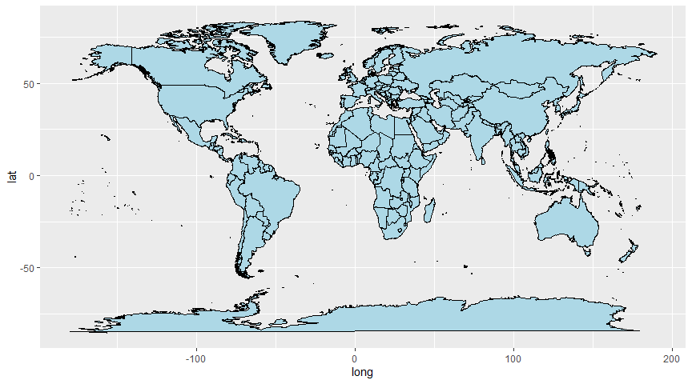
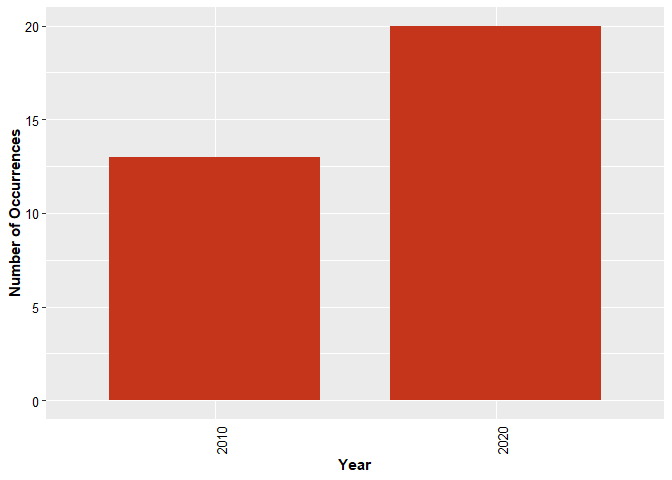
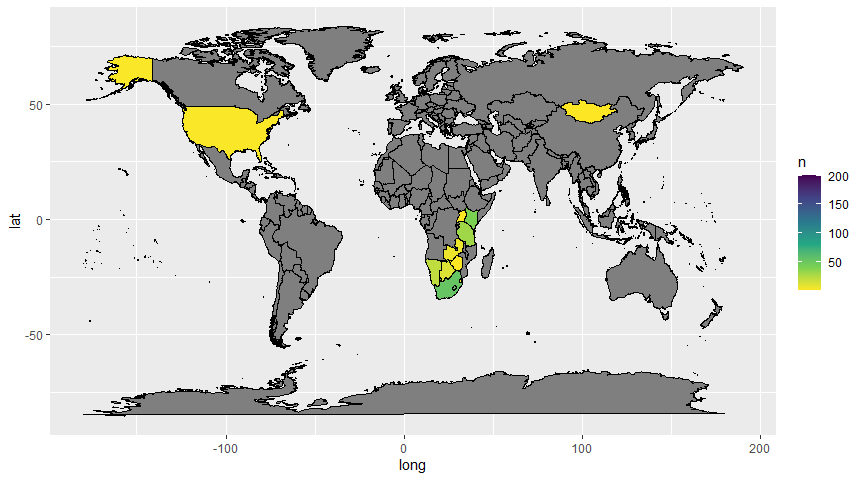
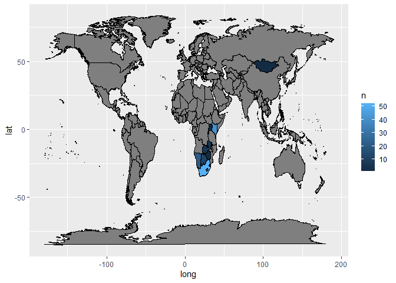

# Geographic Distribution Trends Compared to Extinction Risk of Equines on the IUCN Red List

Faith Rude \| Chris Merkord

Biosciences Department, Minnesota State University Moorhead, 1104 7th
Avenue South, Moorhead, MN 56563 USA

## Abstract

The IUCN Red List of Threatened Species was created to record
information on extinction risk for plants, animals, and fungi. This
project will serve to analyze the geographical distribution of the seven
equine species on the Red List and observe the changes between 2010 and
2020.

The data set being used to determine this was collected from GBIF and is
called the IUCN Red List of Threatened Species. Exploratory data
analysis was be used to find equines that are on the Red List and then
summarize their geographic distribution for 2010 and 2020. A conclusion
was then drawn on the occurrence trend and significance of differences
between the years.

## Introduction

It is understood that biodiversity is crucial to the health of the
planet and connected to the health of humans. Every species has a niche
that they fill, and some of them hold crucial roles. In regards to this
study, equines hold an important role in grassland ecology.

They control plant populations through grazing and aide plant
reproduction through excretion of seeds in new areas. Lastly, their
grazing habits allow them to travel to drier areas than most ruminants.
By grazing these areas, they are able to keep the greenery from growing
too rampantly and running the risk of a fire. (American Wild Horse
Campaign, 2020)

The seven Red List species all originate in Asia where weather can be
harsh and dry. Thus, they play a crucial role in natural fire
prevention. Unfortunately, their populations declined and they ended up
on the IUCN Red List. This analysis will examine the effects of Red List
status–acknowledging existence other existing efforts–to changes in
population over a decade to determine if there is significance.

## Methods

### Data Acquisition

All of the data was analyzed and manipulated using RStudio (RStudio Team
2021). Data was acquired from the Global Biodiversity Information
Facility (GBIF, 2021) in two ways. First, data was imported from the
IUCN Red List of Endangered Species data set (IUCN 2020) and through use
of the R package know as rgbif (Chamberlain et al. 2021, Chamberlain and
Boettiger 2017).

The data set was used to acquire information on which equine species
were on the Red List. The R package was utilized to acquire occurrence
data for each of the species. No special access was required to for any
of these resources, but rgbif had to be downloaded into R Studio.

The relevant data from the IUCN data set was manually dropped into the
project folder after being downloaded. Once in the project folder, it
was read in and transformed into a tibble using the tibble package
(Muller and Wickham, 2020). The occurrence data for each species was
acquired using a search function.

### Data Preparation

After loading a couple packages, data was filtered so that only the
equine species on the Red List remained (Wickham et al, 2020). Once the
equine species were located, only those that had accepted taxonomic
status were selected for. Then, the data was filtered to ignore
subspecies.

Next, several irrelevant columns were removed, leaving the genus, and
the specific epithet (Wickham et al, 2020). The list of species was then
used to acquire occurrence data.

Once the occurrence data was acquired, it was transformed into a tibble.
Unnecessary columns were removed leaving the scientific name year, and
country. The seven species tibbles were then combined into a single
tibble containing the number of occurrences, the year, and the country.

Finally, the data was manipulated to match the naming style within the
map package (Wickham et al, 2020).

Once all the data was organized, a bar graph was used to depict the
occurrence numbers for both 2010 and 2020. Two maps were then created to
depict the distribution of occurrences by country for the two years
(Becker and Wilks, 2018).

Finally, the mean occurrence and standard deviation per country for each
year was calculated (Wickham et al, 2020) and a t-test was run (R Core
Team, 2020).

<!-- -->

Figure 1. A blank world map to be modified with the occurrence data of
the seven equine species.

## Results

<!-- -->

Figure 2. A bar graph depicting a comparison of the total countries with
occurrences of individuals from equine species on the IUCN Red List for
the years of 2010 and 2020.

<!-- -->

Figure 3. A map displaying the occurrence distributions of the seven
equine species for the year 2010. The color gradient depicts density of
occurrences by country. Gray values have no occurrences.

<!-- -->

Figure 4. A map displaying the occurrence distributions of the seven
equine species for the year 2020. The color gradient depicts density of
occurrences by countries. Gray countries have have no occurrences.

## Discussion

The bar graph indicates no difference in number of countries citing
occurrences, but the maps indicate an increase in occurrences and some
variation in which countries name occurrences between 2010 and 2020.

In general, the trend appears to be positive for 2020. While there is
some variation with countries displaying higher or lower occurrences,
overall more countries appear to display high occurrences rates.

Statistically speaking, the average occurrence per country in 2010 was
7.70 with a standard deviation of 14.7 with a sample size of 23. In
2020, the average was 17 with a standard deviation of 39 with a sample
size of 23.

A T-Test was run, returning values of t = -1.4151, p = 0.2393, and 3.5
degrees of freedom. This leads to the end result of not being able to
draw a conclusion.

This study’s p-value is high enough to possibly lean towards no
significance between the two years, however it is low enough to be
possible that there is some level of correlation.

While the Red List aims to bring awareness to the endangered species,
further studies would need to be performed to determine if there is a
significance to the Red List’s efforts in aiding population revival over
the span of its existence.

Future studies could be performed on a broader scale to include more
species and determine a large scale trend in population changes for
endanger animals. In addition, these studies could be performed for
multiple years to show trends throughout time as opposed to two distinct
years.

A related study could include analysis on the success of different
methods for aiding endangered species. These studies could
quantitatively analyze the effectiveness of assorted programs and
determine effectiveness of each in regards to their ultimate goal.

Lastly, If the effects of solely the IUCN’s Red List were wanting to be
measured, more steps would be required to isolate the IUCN’s efforts
from other efforts with the same goal.

## Literature Cited

IUCN (2020). The IUCN Red List of Threatened Species. Version 2020-3.
<https://www.iucnredlist.org>. Downloaded on 2021-02-24.
<https://doi.org/10.15468/0qnb58> accessed via GBIF.org on 2021-03-23.

GBIF.org (2021), GBIF Home Page. Available from: <https://www.gbif.org>
\[24 February 2021\].

Chamberlain S, Barve V, Mcglinn D, Oldoni D, Desmet P, Geffert L, Ram K
(2021). *rgbif: Interface to the Global Biodiversity Information
Facility API*. R package version 3.5.2, &lt;URL:
<https://CRAN.R-project.org/package=rgbif>&gt;.

R Core Team (2020). R: A language and environment for statistical
computing. R Foundation for Statistical Computing, Vienna, Austria. URL
<https://www.R-project.org/>.

Hadley Wickham, Romain François, Lionel Henry and Kirill Müller (2020).
dplyr: A Grammar of Data Manipulation. R package version 1.0.2.
<https://CRAN.R-project.org/package=dplyr>

H. Wickham. ggplot2: Elegant Graphics for Data Analysis. Springer-Verlag
New York, 2016.

Kirill Müller and Hadley Wickham (2020). tibble: Simple Data Frames. R
package version 3.0.4. <https://CRAN.R-project.org/package=tibble>

RStudio Team (2020). RStudio: Integrated Development Environment for R.
RStudio, PBC, Boston, MA URL <http://www.rstudio.com/.E>

(American Wild Horse Campaign, 2020) \*\*\* CITE FULLY \*\*\*
<https://americanwildhorsecampaign.org/wild-horses-and-ecosystem>

Pebesma, E., 2018. Simple Features for R: Standardized Support for
Spatial Vector Data. The R Journal 10 (1), 439-446,
<https://doi.org/10.32614/RJ-2018-009>

Original S code by Richard A. Becker, Allan R. Wilks. R version by Ray
Brownrigg. Enhancements by Thomas P Minka and Alex Deckmyn. (2018).
maps: Draw Geographical Maps. R package version 3.3.0.
<https://CRAN.R-project.org/package=maps>

R Core Team (2020). R: A language and environment for statistical
computing. R Foundation for Statistical Computing, Vienna, Austria. URL
<https://www.R-project.org/>.
