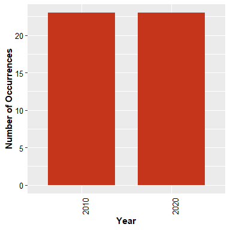
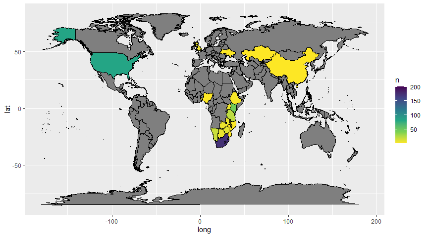

Geographic Distribution Trends Compared to Extinction Risk of Mammals on
the IUCN Red List
================
Faith
2021-04-06

## Abstract

The IUCN Red List of Threatened Species was created in to record
information on extinction risk statuses for plants, animals, and fungi.
It includes information about population sizes, threats, and ecology of
each animal that is considered threatened. This project will serve to
analyze the geographical distribution of the seven equine species on the
Red List and observe if the trends match what would be expected of
dominantly Asian equine species. The data set being used to determine
this was collected from GBIF and is called the IUCN Red List of
Threatened Species. The data will be taken and exploratory data analysis
will be used to find equines that are listed on the Red List and then
quantitatively summarize their geographic distribution in the years 2010
and 2020 and visualize it. A conclusion will then be drawn as to whether
or not the seven species are falling farther into risk or beginning to
climb out of it. Finally, a statistical test will determine the
significance of the occurrences between 2010 and 2020.

## Introduction

Since the rise of human kind, drastic changes have begun occurring on
the planet. One such thing is the rapid climb in extinction rates for
non-human organisms. Some estimates show that humans have begun causing
extinctions so quickly, that species are going extinct before anyone was
able to ever note their existence. It is now understood to a large
degree that biodiversity is crucial to the health of the planet, and in
some ways directly connected to the health of humans. Every species has
a niche that they fill, and some of them hold crucial roles. In regards
to this study, equines hold an important role in grassland ecology. They
help control populations of plants by keeping them grazed down, some of
which are undesireable weeds that choke out other plants. Furthermore,
due to the structure of the equine digestive system they release some of
the plant’s seeds back into nature through their excreted waste.
Furthermore, their grazing habits allow them to travel farther distances
from water than most ruminants or other grazers, allowing them to graze
in areas that are drier. By grazing in these areas, they are able to
keep the greenery from growing too rampantly, and running the risk of a
fire. (American Wild Horse Campaign, 2020) In the case of the seven
equine species on the red list, all originate in areas of Asia where
weather in certain areas can be harsh and dry. Thus, they play a crucial
role in natural fire prevention for their countries of origin.
Unfortunately, for various reasons, their populations declined enough to
warrant their placement on the IUCN Red List. These species have been on
the Red List for several years now, and attention has been brought to
their status. This analysis will now serve to look at this effort–among
other existing efforts–to help revive the population to determine if
there is a significance in the change of equine populations over the
last decade.

## Methods

### Data Acquisition

For this project, all of the data was analyzed and manipulated using
RStudio (RStudio Team 2021). Data was acquired from the Global
Biodiversity Information Facility, abbreviated GBIF (GBIF, 2021). The
data was acquired in two ways. Firstly, data was imported from the IUCN
Red List of Endangered Species data set (IUCN 2020)–abbreviated IUCN
List throughout the rest of the presentation. This data set was used to
acquire information on which equine species were on the IUCN’s Red List.
Secondly, the R package know as rgbif (Chamberlain et al. 2021,
Chamberlain and Boettiger 2017) was utilized to acquire the occurrence
data for each of the equine species on the list. No special access was
required to for any of these resources, but rgbif had to be downloaded
into R Studio using the function before the occurrence data on GBIF
could be accessed. Furthermore, the data from the IUCN List had to be
manually dropped into the project folder once downloaded. There were
three files, but only the file labeled taxon.txt contained relevant
information. Once the file was in the project folder, it could be read
in and transformed into a tibble using the tibble package (Muller and
Wickham, 2020). This imported the data in a manner that would allow for
more convenient analysis and modification in the future.

Finally, the occurrence data for each of the seven species were acquired
using the function with the amount limit being set at its maximum to
ensure the most accurate information be returned. The search function
was applied to each species individually to allow for occurrence
searches based on each one’s specific scientific name.

### Data Preparation

Beginning with the IUCN List, data was prepared for analysis first by
filtering through all the species present on the Red List so that only
the equine species were present. This was done by filtering the data to
only show species who’s family was Equidae. Once the equine species were
located, only those that had accepted taxonomic status were selected
for. Then, the data was filtered to only show species as opposed to
including subspecies and species.

Next, to make the data easier to navigate several columns not relevant
to the goal were removed, leaving only the taxon ID, the genus, and the
specific epithet. Once this was finished, this data was used in the
previously mentioned acquisition of occurrence data.

Once the occurrence data was acquired, it had to undergo several changes
to make it more usable. Firstly, the data had to be transformed from a
RGBIF format to a tibble format. Once the data set was placed into
tibble format, unnecessary columns were removed. The columns that
remained were the scientific Name, the the year, and the country. Once
all of the species were refined, their individual tibbles were combined
into a master tibble that would allow for collection of all occurrences
to be seen together.

The tibbles were combined to list the number of occurrences by country
and year.

Finally, due to discrepancies in how each country was named–such as
capitalization, use of unique characters, and abbreviations–the data was
manipulated to make all the naming styles uniform. This allowed for
cleaning appearances in the graph, and more accurate representation of
the distribution of the seven species.

Once all the data was organized in a manner that could allow
visualization, a bar graph was used to depict the occurrence numbers for
both 2010 and 2020. Two maps were then created to depict a visual
distribution of occurrences for both years. A t-test was then performed
to determine if the differences between the two years was significant.

<!-- -->

## Results

<!-- -->

<!-- -->

<!-- -->

## Discussion

## Literature Cited

IUCN (2020). The IUCN Red List of Threatened Species. Version 2020-3.
<https://www.iucnredlist.org>. Downloaded on 2021-02-24.
<https://doi.org/10.15468/0qnb58> accessed via GBIF.org on 2021-03-23.

GBIF.org (2021), GBIF Home Page. Available from: <https://www.gbif.org>
\[24 February 2021\].

Chamberlain S, Barve V, Mcglinn D, Oldoni D, Desmet P, Geffert L, Ram K
(2021). *rgbif: Interface to the Global Biodiversity Information
Facility API*. R package version 3.5.2, \<URL:
<https://CRAN.R-project.org/package=rgbif>\>.

R Core Team (2020). R: A language and environment for statistical
computing. R Foundation for Statistical Computing, Vienna, Austria. URL
<https://www.R-project.org/>.

Hadley Wickham, Romain François, Lionel Henry and Kirill Müller (2020).
dplyr: A Grammar of Data Manipulation. R package version 1.0.2.
<https://CRAN.R-project.org/package=dplyr>

H. Wickham. ggplot2: Elegant Graphics for Data Analysis. Springer-Verlag
New York, 2016.

Kirill Müller and Hadley Wickham (2020). tibble: Simple Data Frames. R
package version 3.0.4. <https://CRAN.R-project.org/package=tibble>

RStudio Team (2020). RStudio: Integrated Development Environment for R.
RStudio, PBC, Boston, MA URL <http://www.rstudio.com/.E>

(American Wild Horse Campaign, 2020) \*\*\* CITE FULLY \*\*\*
<https://americanwildhorsecampaign.org/wild-horses-and-ecosystem>

Pebesma, E., 2018. Simple Features for R: Standardized Support for
Spatial Vector Data. The R Journal 10 (1), 439-446,
<https://doi.org/10.32614/RJ-2018-009>

Original S code by Richard A. Becker, Allan R. Wilks. R version by Ray
Brownrigg. Enhancements by Thomas P Minka and Alex Deckmyn. (2018).
maps: Draw Geographical Maps. R package version 3.3.0.
<https://CRAN.R-project.org/package=maps>
